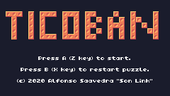
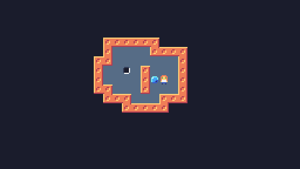

# Ticoban

[Play online version/Juega a la versión en linea](https://tic80.com/play?cart=1439)

## English

A Sobokan clone make with [TIC-80](https://tic80.com). 

In this game you must move the balls to the holes to go to the next level.

### Controls

* A button (Z key): OK
* B button (X key): Reset the map
* Pad / keyboard arrows: scroll (left and right in the language selection to select it)

### Special thanks

To the people of the Telegram channel of [Jugando En Linux] (https: //jugandoenlinux.xom), for trying it and supporting me.
* To Kyle Smith "Frantisek" for the functions that allow the use of UTF-8 characters in TIC-80: https://tic80.com/play?cart=468

Under the GNU/GPL3 or newer license, minor the utf functions, under the BSD license.

## Español

Un clone de Sokoban hecho con [TIC-80](https://tic80.com).

En este juego debes de mover las bolas hasta los agujeros para pasar al siguiente nivel.

### Controles:

* Botón A (tecla Z): Aceptar
* Botón B (tecla X): Reiniciar el mapa
* Pad (Flechas teclado): desplazarse (izquierda y derecha en la de selección de idioma para seleccionarlo)

### Agradecimientos

* A la gente del canal de Telegram de [Jugando En Linux](https://jugandoenlinux.xom), por probarlo y soportarme.
* A Kyle Smith "Frantisek" por las funciones que permiten usar caracteres UTF-8 en TIC-80: https://tic80.com/play?cart=468 .

Bajo licencia GNU/GPL3 o más reciente, menos las funciones de utf8 que están bajo licencia BSD

